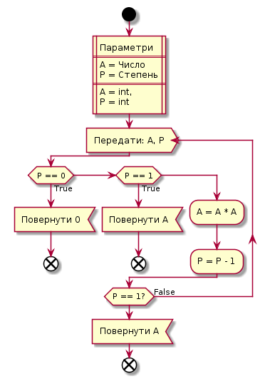
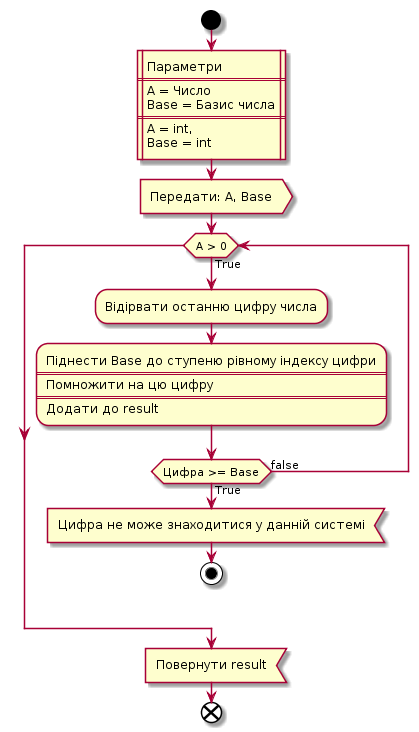
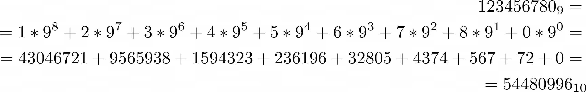
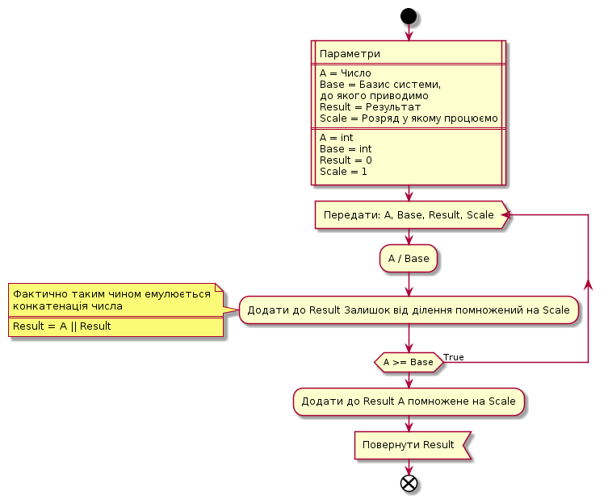
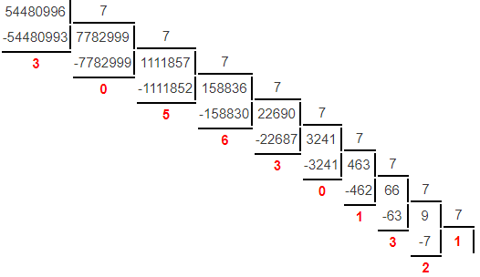

## Завдання
Розробити прикладну програму мовою *C++*, що переводить число з 9-ї системи числення до 7-ї.
## Виконання
```c++
#include <iostream>
#include <string>
using namespace std;

int power(int x, int p) {
    if (p == 0) return 1;
    if (p == 1) return x;
    return x * power(x,p-1);
}

int translate_to_ten(int number, int base) {
    int result = 0;
    for(int i = 0; number; i++) {
        int pow = power(base, i);
        int part = number % 10;
        if (part >= base) throw runtime_error("Unacceptable digits for this base");
        result += part * pow;
        number /= 10;
    }
    return result;
}

int translate_to_base(int number, int base, int result=0, int scale=1) {
    if (number>=base) {
        int next = number / base;
        result += (number % base) * scale;
        scale *= 10;
        return translate_to_base(next, base, result, scale);
    } else {
        result += number * scale;
        return result;
    }
}

int main() {
    int base9_number, base7_number, base10_number;
    char checker;
    cout << "Enter your number:  ";
    cin >> base9_number;
    cout << "" << endl;
    try {
        base10_number = translate_to_ten(base9_number, 9);
        base7_number = translate_to_base(base10_number, 7);
        cout << "Base 9  number: " << base9_number << endl;
        cout << "Base 7  number: " << base7_number << endl;
        cout << "Base 10 number: " << base10_number << endl;
    } catch (runtime_error e) {
        cout << "Runtime error: " << e.what();
    }
    return 0;
}
```
## Опис
Код складається з 4-ох функцій.
* `main`
* `power`
* `translate_to_ten`
* `translate_to_base`
### main
У функції `main` отримуються вхідні дані від користувача, відповідно переводяться з 9-ї до 7-ї системи за допомогою інших функцій, результат виводиться у консоль та програма завершується.
### power
Це звичайна рекурсивна функція, що приймає 2 числових аргументи та повертає перше у ступені другого. *(a, b) -> a^b*
Функція працює наступним чином:  

### translate_to_ten
Ця функція приймає 2 числових аргументи. Перше - це число, що необхідно конвертувати. Друге - це число, що вказує на систему числення, у якій знаходиться перше. Після виконання функція повертає перше число у десятковій системі числення.  
Функція працює наступним чином:  
  
Обчислення відбуваються за прикладом:  

### translate_to_base
Ця функція приймає 4 числових аргументи. Перше - це число, що необхідно конвертувати, друге - це система числення, у яку конвертується перше. Третє - це результат функції, що по замовчуванню дорівнює 0. Четверте - вказує на розряд у якому відбувається обчислення, по замовчуванню = 1. Функція повертає перше число у системі числення з базисом рівним другому числу.  
Функція працює наступним чином:  
  
Обчислення відбуваються за прикладом:  

## Висновок
В ході даної роботи було створено код, що переводить числа з 9-ї системи числення до 7-ї. Функції що переводять число є універсальними, та можуть переводити числа між усіма системами від 2-ї до 10-ї. При бажанні у функціях можна замінити числа що обробляються на масиви , і кожен елемент змінювати на відповідну літеру, таким чином додати можливість конвертувати числа між 36-ма системами, за умови цифр 0-9, та літер A-Z, та між 60, якщо додати літери a-z. 


